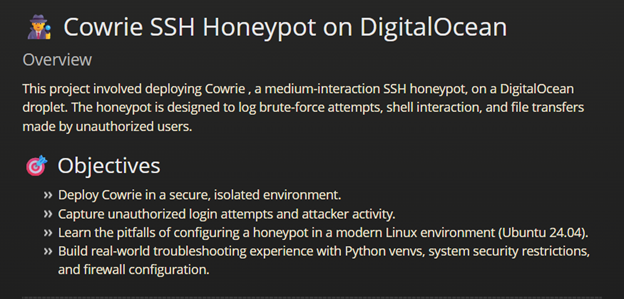

<nav class="navbar">
  <ul>
    <li><a href="./index.md">🏠 Home</a></li>
    <li><a href="./projects.md">💻 Projects</a></li>
    <li><a href="./writeups.md">📝 Writeups</a></li>
    <li><a href="./labs.md">🔨 Labs</a></li>
  </ul>
</nav>

---

# 👋 Hello, I'm Christian Galvez

Certified and aspiring cybersecurity professional with a foundation in technical support, security documentation, and vulnerability analysis. This portfolio showcases my hands-on skills and knowledge in cybersecurity operations, cloud platforms, and secure system design.

- **Location**: Egg Harbor, NJ
- **Certifications**: Security+, Network+, A+, ITIL v4, AZ-900, ISC2 CC
- **Degree**: B.S. in Cybersecurity (in progress, WGU)
- [Download Resume](assets/Resume.pdf)

---

## 🌟 Featured Projects  

<body>
  

    

      <a href="writeups/honeypot-project.md">
        

          
          
        

        
Honeypot Project

      </a>
    

    

      <a href="writeups/other-project.md">
        

          
          
        

        
Other Project

      </a>
    

  

</body>
<head>
  <meta charset="UTF-8">
  <title>My Portfolio</title>
  
</head>

---

Explore my work:
- [Projects](projects.md)
- [Labs](labs.md)
- [Writeups](writeups.md)
