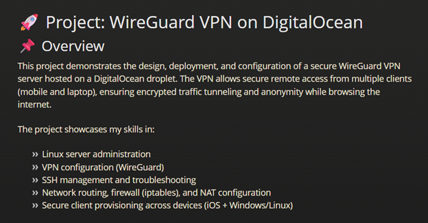

<nav class="navbar">
  <ul>
    <li><a href="./index.md">🏠 Home</a></li>
    <li><a href="./projects.md">💻 Projects</a></li>
    <li><a href="./writeups.md">📝 Writeups</a></li>
    <li><a href="./labs.md">🔨 Labs</a></li>
  </ul>
</nav>

---

# 👋 Hello, I'm Christian Galvez

Certified and aspiring cybersecurity professional with a foundation in technical support, security documentation, and vulnerability analysis. This portfolio showcases my hands-on skills and knowledge in cybersecurity operations, cloud platforms, and secure system design.

- **Location**: Egg Harbor, NJ
- **Certifications**: Security+, Network+, A+, ITIL v4, AZ-900, ISC2 CC
- **Degree**: B.S. in Cybersecurity (in progress, WGU)
- [Download Resume](assets/Resume.pdf)

---

## 🌟 Featured Projects  

  

    
    <h3>🔒 Cowrie SSH Honeypot</h3>
    
Tracked real-world unauthorized login attempts and learned to troubleshoot Python environments, system paths, and log analysis.

  

  

    
    <h3>🔐 WireGuard VPN with Firewall Hardening</h3>
    
Configured a secure VPN on a cloud server, with added firewall rules for resilience against brute force and scanning attempts.

  

---

Explore my work:
- [Projects](projects.md)
- [Labs](labs.md)
- [Writeups](writeups.md)
